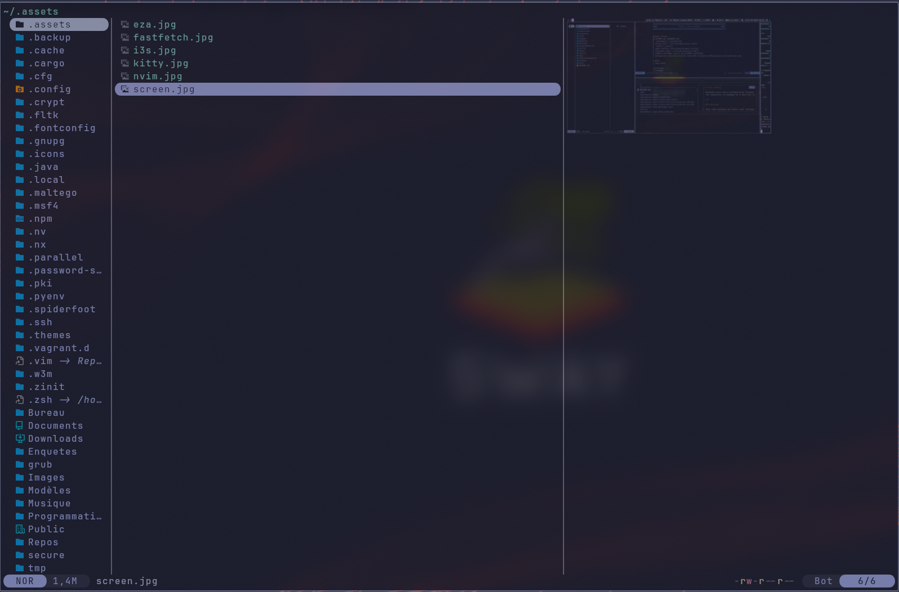
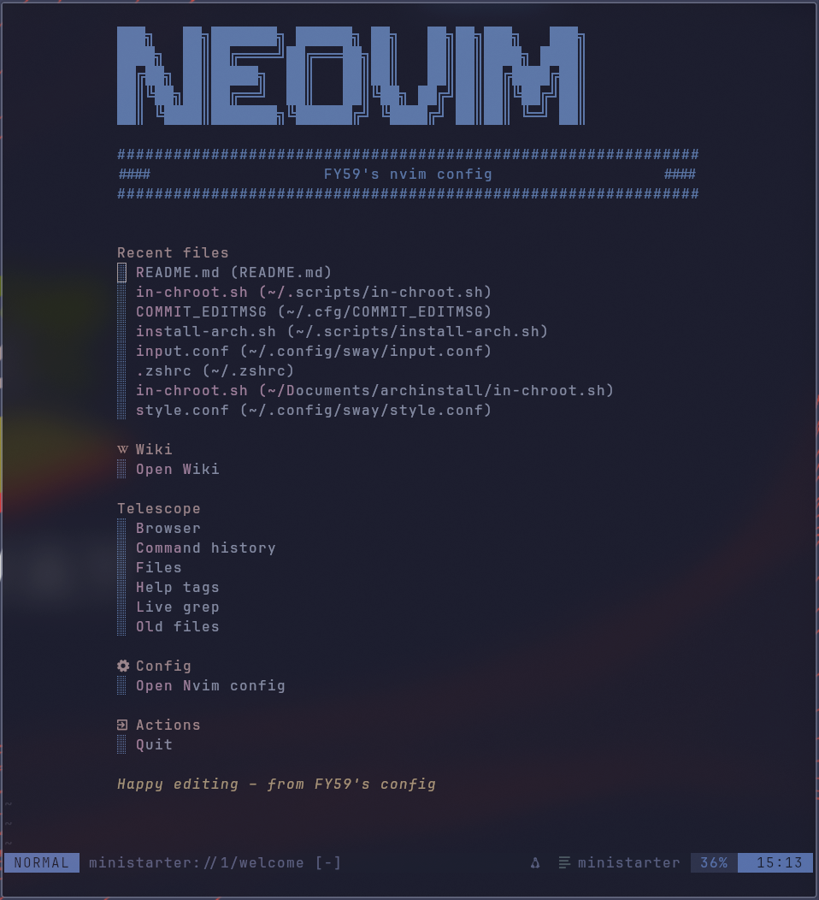
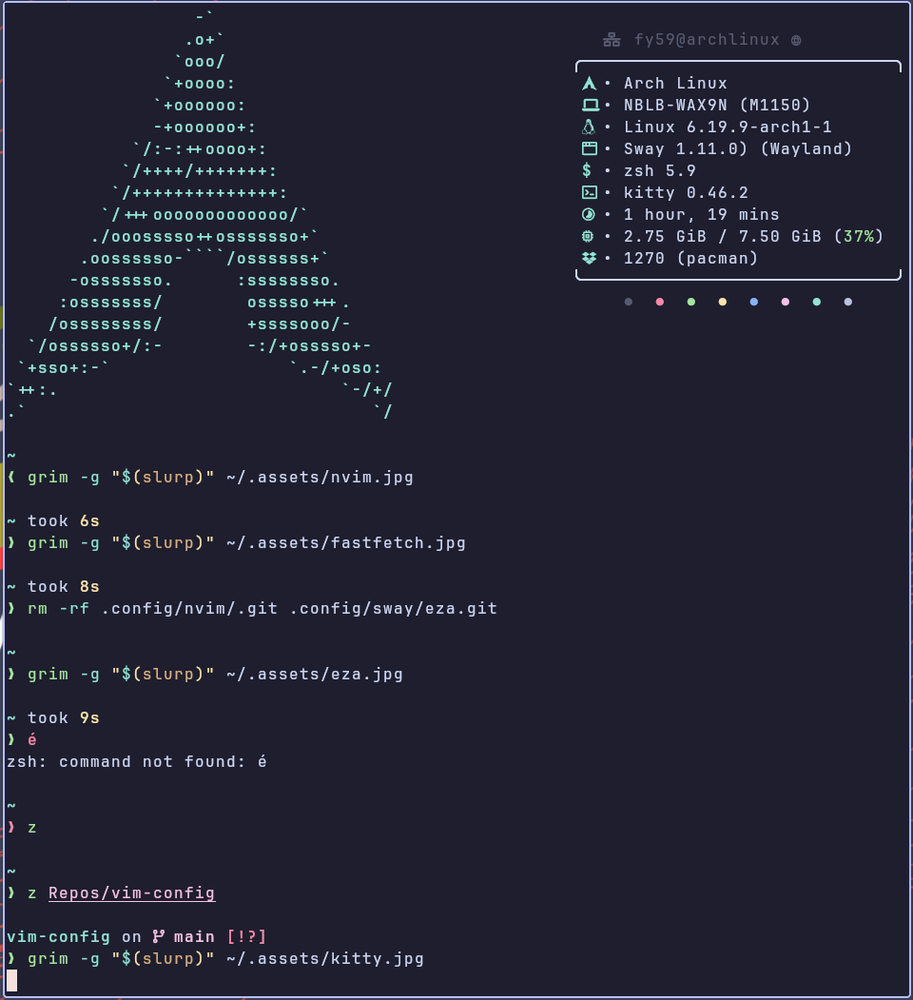
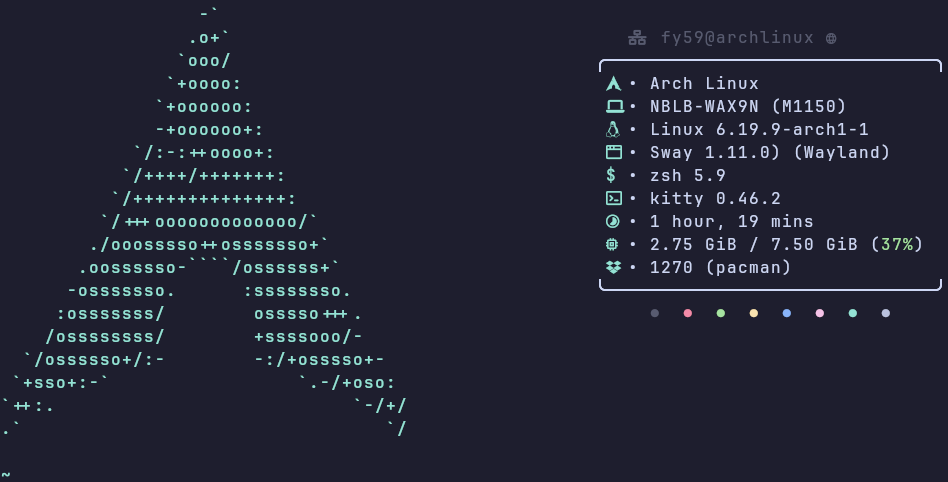
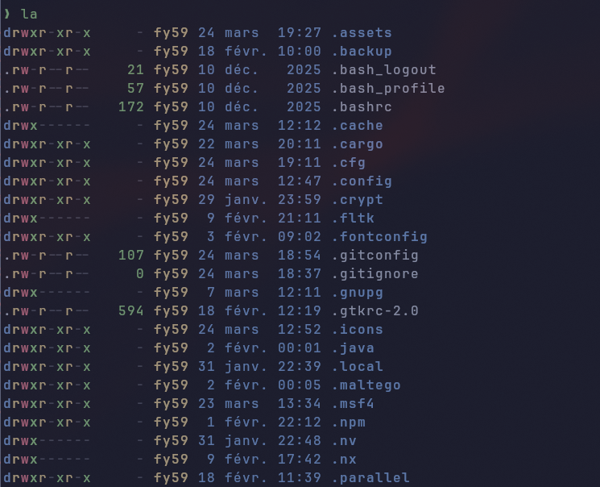
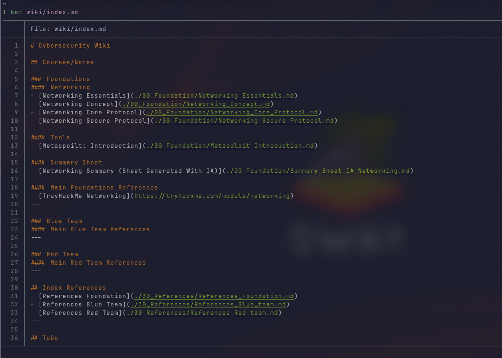

# ArchASP – Arch Sway Pentest
<p align="center">
<picture>
    
</picture>

Personal Arch Linux configuration focused on: 

- Keyboard-driventerminal-first
- Terminal-first workflow with Sway, Neovim, Kitty
- Catppuccin Mocha themed UI.  

**Goal** : 
all reproducible from a single install script and a GNU Stow‑managed dotfiles repo.
<p>

---

## Overview

This repo contains my entire user configuration, including:

- Zsh shell configuration with plugins, history tuning, fuzzy-finding and Python helpers
- A Catppuccin Mocha desktop theme applied consistently across GTK 3/4, Qt
- Sway configuration split into modular files with custom keybinds, bar, rules and styling
- Neovim configuration using Lua, Lazy, Treesitter, LSP and a full plugin setup
- Kitty terminal configuration with a large theme collection and a current theme
- Extra configs for GTK, Qt, TUI tools (yazi, fastfetch, calcure, bat, eza, cliphist, i3status-rust)

The goal is to provide an opinionated but reusable starting point for an Arch/Linux tiling window manager environment.

---

## Required packages

This setup assumes the following tools are installed (Arch package names):

- swayfx (Wayland tiling window manager)
- swaylock-effects
- swayidle
- wofi (Wayland application launcher)
- i3status-rust (status bar blocks)
- kitty (terminal emulator)
- neovim (text editor)
- zsh (shell)
- starship (prompt)
- fzf (fuzzy finder)
- fd (fast file search, used by fzf)
- ripgrep (rg, fast grep)
- eza (ls replacement)
- fastfetch (system info on shell startup)
- yazi (terminal file manager)
- bat (cat replacement with syntax highlighting)
- cliphist (Wayland clipboard manager)
- calcure (terminal calendar and tasks)
- zoxide (smart cd)
- pyenv (Python version manager)
- git (version control)
- yay or paru (AUR helper, optional but recommended)
- gtk3
- gtk4
- catppuccin-gtk-theme-mocha
- catppuccin-cursors-mocha

Install on Arch Linux for example:

```bash
yay -S --needed \
  swayfx wofi i3status-rust kitty neovim zsh \
  starship fzf fd ripgrep eza fastfetch yazi bat \
  cliphist calcure zoxide pyenv git \
  gtk3 gtk4 catppuccin-gtk-theme-mocha \
  catppuccin-cursors-mocha swaylock-effects \
  swayidle 
```

For AUR-only tools on your system, use your preferred AUR helper (yay, paru, etc.).

---

## Zsh configuration

The Zsh configuration (`.zshrc`) is kept intentionally minimal and fast, while providing a modern shell experience.

Main features:

- Clean history settings (shared, deduplicated, trimmed) with a large history size
- Completion system using `compinit`, cached in `~/.cache/zsh`, with case-insensitive matching and colored completions
- Fastfetch banner on interactive shell startup if available
- Plugin setup without a plugin manager:
  - `zsh-autosuggestions`
  - `fast-syntax-highlighting`
  - `fzf-tab`
- Prompt powered by `starship` with config in `~/.config/starship.toml`
- Incremental history search via `zsh-history-substring-search` (up/down arrows)
- Tight integration with `fzf` and `zoxide`:
  - Custom `FZF_DEFAULT_COMMAND` and previews using `bat`
  - Key bindings and completion from the system `fzf` scripts
- Convenient aliases:
  - Navigation (`..`, `...`, `....`)
  - Tools (`b` for yazi, `n` for neovim)
  - Git shortcuts (`g`, `gs`, `ga`, `gc`, `gp`, `gl`)
  - `eza` replacing `ls` with different presets
  - `rg` as default grep-like search
- OSINT helpers:
  - `whois-ip`, `geoip`, `myip`, `headers`, `dns`, `subdomains`, `shot`, `topcmd`
- Arch Linux workflow:
  - `pacman` and `yay` aliases for install, upgrade, cleanup, orphan handling
  - `journalctl` aliases (`jlog`, `jfollow`, `jboot`)
- Utility functions:
  - `extract` for unpacking many archive formats
  - `mkcd` to create and enter a directory
  - `psgrep` to search running processes
- Python / pyenv helpers:
  - pyenv initialization
  - `va` to activate `venv/` or `.venv/`
  - aliases for creating, destroying and managing virtualenvs and `requirements.txt`

---

## Themes: `.themes/Catppuccin-Mocha`

This directory contains the Catppuccin Mocha theme adapted for several environments:

- `cinnamon/`  
  Cinnamon desktop theme, including CSS and assets like checkboxes, toggles and window control icons.
- `gnome-shell/`  
  GNOME Shell theme with CSS files and SVG assets for shell elements (calendar, toggles, process animation).
- `gtk-2.0/`, `gtk-3.0/`, `gtk-4.0/`  
  GTK themes for legacy and modern GTK applications, including:
  - `gtkrc` and `gtkrc.hidpi` for GTK2
  - `gtk.css` and `gtk-dark.css` plus a large set of SVG assets for GTK3/4 widgets (checkboxes, radio buttons, sliders, etc.).
- `metacity-1/`  
  Window manager theme for Metacity-based environments.
- `plank/`  
  Theme for the Plank dock (`dock.theme`).
- `xfwm4/`  
  Theme configuration for XFWM4 window manager.
- `index.theme`  
  The theme index file used by the system to register Catppuccin Mocha.

This ensures a consistent Catppuccin Mocha look across desktops, apps and widgets.

---

## Yazi: `.config/yazi`



Configuration for the Yazi terminal file manager:

- `yazi.toml`  
  Main Yazi configuration.
- `theme.toml`  
  Custom Yazi theme to match the overall colors.
- `keymap.toml`  
  Custom key mappings for navigation and actions.
- `package.toml`  
  Package metadata for the configuration.
- `flavors/tokyo-night.yazi/`  
  Additional theme flavor based on Tokyo Night, with its own README, flavor definition and preview.

---

## Wofi: `.config/wofi`

Configuration for Wofi, a Wayland application launcher and cliphist manager:

- `config`  
  Main Wofi settings (mode, matching, behavior).
- `style.css`  
  CSS styling to match the Catppuccin-like look.
- `wifi`  
  Script or configuration used to manage Wi-Fi selection via Wofi.

---

## Starship: `.config/starship.toml`


Prompt configuration for the Starship prompt, referenced from `.zshrc`.  
It defines the segments, colors and layout of the prompt to integrate visually with the rest of the setup.

---

## Sway: `.config/sway`

Sway configuration is split into multiple modular files for clarity:

- `config`  
  Main Sway configuration file that typically includes the others.
- `autostart.conf`  
  Applications and services launched automatically when Sway starts.
- `bar.conf`  
  Status bar configuration, including integration with `i3status-rust`.
- `bind.conf`  
  Keybindings for window management, launching applications, workspaces, etc.
- `input.conf`  
  Input configuration (keyboard, touchpad, etc.).
- `rules.conf`  
  Window rules (floating windows, specific workspaces, etc.).
- `style.conf`, `swayfx.conf`, `tty-style.conf`  
  Visual tweaks, SwayFX configuration and TTY-like styling.
- `catppuccin-mocha`  
  Theme-related configuration for Sway using the Catppuccin Mocha palette.
- `i3status.toml`  
  Configuration file for `i3status-rust` used in the bar.
- `assets/screen.jpg`  
  Screenshot or background asset.
- `scripts/`  
  Helper scripts:
  - `cliphist-wofi-img` to integrate clipboard history with Wofi and images
  - `inactive-windows-transparency.py` for window transparency effects
- `README.md`  
  Local documentation for the Sway setup.

---

## Qt: `.config/qt5ct` and `.config/qt6ct`

Qt theming configuration using `qt5ct` and `qt6ct`:

- `colors/catppuccin-mocha-lavender.conf`  
  Qt colour scheme matching the Catppuccin Mocha palette.
- `qss/`  
  Extra styling via Qt Style Sheets.
- `qt5ct.conf`, `qt6ct.conf`  
  Main Qt configuration files for both Qt5 and Qt6, aligning fonts, colors and style.

---

## Neovim: `.config/nvim`



Neovim configuration built in Lua with a modern plugin stack:

- `init.lua`  
  Entry point that sets up Neovim and loads modules.
- `lua/config/`  
  Core configuration:
  - `lazy.lua` for the Lazy plugin manager
  - `maps.lua` for key mappings
  - `markdown.lua` for markdown-related settings
- `lua/plugins/`  
  Plugin configuration files, one per plugin or group:
  - `bufferline.lua`
  - `catppuccin.lua`
  - `cmp.lua`
  - `colorscheme.lua`
  - `filebrowser.lua`
  - `gitsign.lua`
  - `lsp.lua`
  - `mini-icons.lua`
  - `mini_map.lua`
  - `neowiki.lua`
  - `nvim-autopair.lua`
  - `outline.lua`
  - `render-markdown.lua`
  - `starter.lua`
  - `telescope.lua`
  - `treesitter.lua`
  - `ui.lua`
  - `vim-fugitive.lua`
  - `witch-key.lua` (which-key style helper)
  - `nvim-tree.lua.old` (old configuration kept for reference)
- `lazy-lock.json`  
  Lockfile for Lazy to pin exact plugin versions.
- `assets/`  
  Screenshots and images for documentation (`nvim-starter.*`, `screen.jpg`).
- `LICENSE.md`, `readme.md`  
  Local documentation and license for the Neovim configuration.

This setup gives a modern, IDE-like Neovim experience with LSP, Treesitter, file browsing, git integration, markdown rendering and more.

---

## Kitty: `.config/kitty`

Kitty terminal configuration and themes:



- `kitty.conf`  
  Main Kitty configuration (fonts, window behavior, keybindings, etc.).
- `current-theme.conf`  
  Includes or defines the currently active theme.
- `kitty-themes/`  
  A full copy of the kitty-themes collection:
  - `LICENSE.md`, `README.md`, `CONTRIBUTING.md`
  - `themes/*.conf`  
    Hundreds of ready-to-use color schemes (Solarized, Dracula, Gruvbox, Monokai variants, Catppuccin-like themes, etc.).

This allows instant switching between many color schemes while defaulting to a Catppuccin-style dark theme.

---

## Other configs

Additional directories complete the environment:

- `.config/i3status-rust/`  
  Used by the Sway bar via `i3status.toml` (config content is referenced from Sway’s side).
  

- `.config/gtk-3.0/` and `.config/gtk-4.0/`  
  GTK settings and overrides for applications using GTK3/GTK4 (bookmarks, settings backups, etc.).
- `.config/fastfetch/config.jsonc`  
  Fastfetch configuration controlling system summary display in the terminal.
  

- `.config/eza/catppuccin-mocha-lavender.yml`  
  eza color theme file tuned to match Catppuccin Mocha.
  

- `.config/cliphist/config`  
  Configuration for cliphist clipboard manager.
- `.config/calcure/`  
  Calcure TUI calendar and task manager configuration:
  - `config.ini`
  - `events.csv`
  - `tasks.csv`
  - `info.log`
- `.config/bat/themes/Catppuccin Mocha.tmTheme`  
  Bat syntax highlighting theme, again using Catppuccin Mocha.
  

---

## Installation (on existing system)

```bash
sudo pacman -S stow git base-devel
cd /tmp
git clone https://aur.archlinux.org/yay.git
cd yay
makepkg -si
```

```bash
yay -S catppuccin-cursors-mocha catppuccin-gtk-theme-mocha && git clone https://github.com/grayTerminal-sh/archasp.git
```

```bash
mkdir ~/.dotfiles
```

```bash
mv ~/archasp/* ~/.dotfiles
rm -r ~/archasp
```

```bash
cd ~/.dotfiles
```

```bash
stow \
    bat btop calcure cliphist\ 
    eza fastfetch gtk-3.0\ 
    gtk-4.0 icons kitty nvim\ 
    qt5ct qt6ct starship sway\ 
    swaylock swaync themes wofi\ 
    yazi zsh
```

```bash
yay -S\ 
    bat btop calcure cliphist\
    eza fastfetch gtk-3.0\
    gtk-4.0 icons kitty nvim\
    qt5ct qt6ct starship\
    swayfx swaylock swaync\
    themes wofi yazi zsh

```

---
